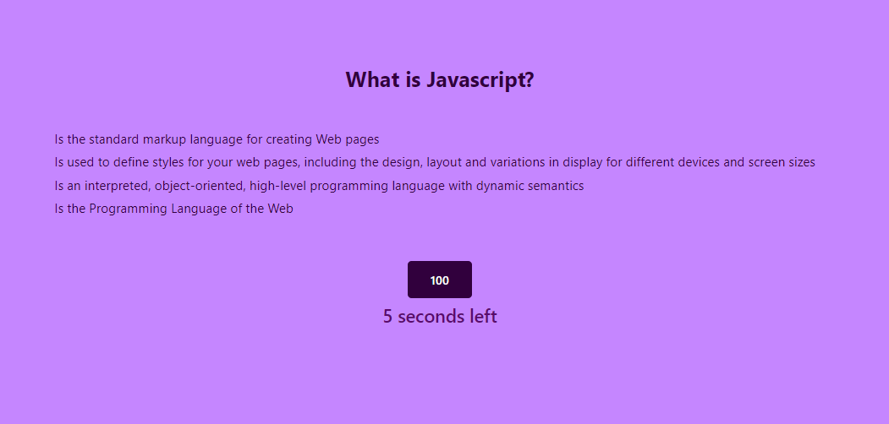
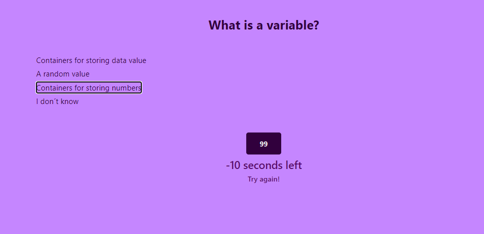

# code-quiz-file

## Description
The project was made in order to build a quick quiz that allows people to test their knowledge about javascript. This quiz can be also used to study about the topic.  

## Project status
This project will be updated with some improvement regarding the score, timer and user input. 

## Installation
 * Create a repo on GitHub
 * Clone the repo on the computer
 * Create an HTML, CSS and Javascript file
 * Write the structure of the web with HTML and style it with CSS style sheet
 * Write the Javascript code 
 * Use google DevTools in order to inspect if the code, specially javascript, is running correctly
 * Pull and commit changes on Github
 * Publish the website on Github pages

## Finished Project

## Link to the website
https://sofiacrf.github.io/code-quiz/